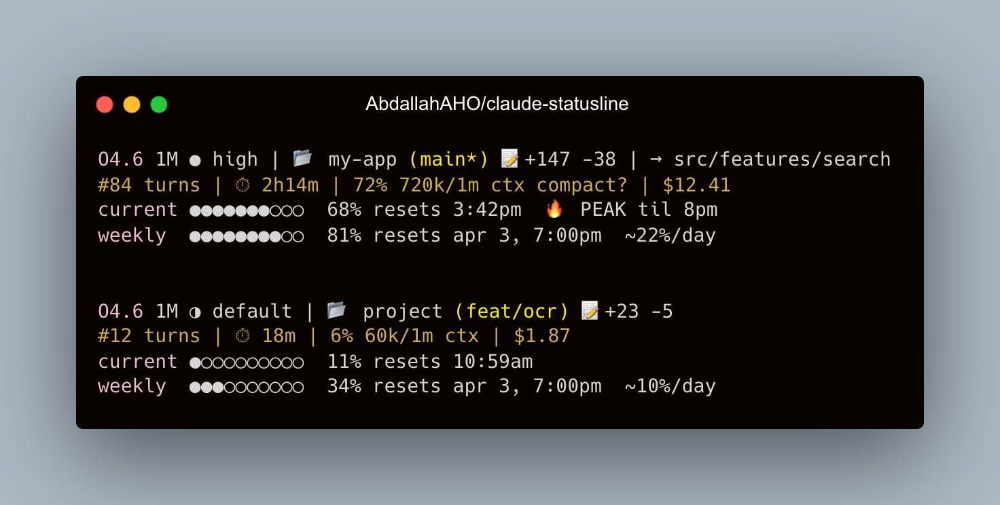

# ccline

A feature-rich statusline for [Claude Code](https://docs.anthropic.com/en/docs/claude-code) that helps you track session health, manage quota, and avoid burning through your Max plan.



## What you get

**Line 1 — Identity & Project**
```
O4.7 1M ● high 🛡 plan | 📂 really-app (main*) 📝+147 -38 | @code-reviewer | ⎇ feat-x | → src/features/search
```
- Compact model name with effort level
- Permission mode badge — `🛡 plan`, `✎ auto` (acceptEdits), or `⚡ bypass` (bypassPermissions). Hidden in default mode.
- Output-style badge (e.g., `◎ Learning`) when not `default`
- Vim mode indicator (`[N]` / `[I]`) when vim mode is on
- Project root with git branch and dirty indicator (single `git status` call)
- Lines changed this session
- Subagent name (`@code-reviewer`) and worktree (`⎇ feat-x`) when active
- `⚠ downgraded` flag when Claude Code has fallen back to the 200k-context tier
- Current working directory (relative to project, fish-style abbreviation if outside)

**Line 2 — Session Health**
```
#84 turns | ⏱ 2h14m | 72% 720k/1m ctx compact soon | $12.41 | api 66%
```
- Real user-turn counter (yellow at 30, red at 50 — tool results no longer inflate the count)
- Session duration (cross-platform — uses birthtime on macOS/Linux with mtime fallback on filesystems that don't track it)
- Context window usage with `compact soon` / `compacting…` / `⛔ blocked` warnings matching Claude Code's actual autocompact thresholds (20k / 13k / 3k below the context limit)
- Running session cost (yellow at $5, red at $10)
- API-latency ratio — what fraction of total wall time was spent waiting on the model

**Lines 3-4 — Quota & Rate Limits**
```
current ●●●●●●●○○○  68% resets 3:42pm  🔥 PEAK til 8pm
weekly  ●●●●●●●●○○  81% resets apr 3, 7:00pm  ~22%/day ⚡
```
- Rate limits read directly from Claude Code's input JSON (freshest data); OAuth API serves as a fallback when input is empty (cached 60s at `${TMPDIR:-/tmp}/claude-$UID/`)
- Peak hour detection (05:00–11:00 PT) with local end time — only shows when active
- Weekly burn rate projection — green if on pace, yellow if tight, red if you'll hit the limit
- `⚡ burning fast` on either window when you're tracking ahead of schedule

## Install

```bash
npx @abdallahaho/ccline@latest
```

This copies the statusline script to `~/.claude/statusline.sh` and configures your `~/.claude/settings.json`. Restart Claude Code to see it.

If you already have a custom statusline, it's backed up to `statusline.sh.bak` first.

## Requirements

- `bash`, `jq`, `curl`, `git`
- Claude Code with an active Max/Pro subscription (for rate limit bars)

```bash
# macOS
brew install jq

# Ubuntu / Debian / WSL
sudo apt install jq curl git

# Windows (Git Bash / MSYS2)
pacman -S jq curl git
# or with Chocolatey from PowerShell:
choco install jq curl git
```

### Windows notes
ccline runs under **Git Bash**, **MSYS2**, or **WSL** — it is a bash script, not a native PowerShell one. Make sure Claude Code itself is launched from one of those shells so that the statusline command resolves `bash` correctly. PowerShell users can point the `statusLine` entry at `bash -c "$HOME/.claude/statusline.sh"` but running Claude Code under Git Bash or WSL is simpler.

## Uninstall

```bash
npx @abdallahaho/ccline@latest --uninstall
```

Restores your previous statusline if a backup exists, or removes it and cleans up settings.json.

## How it works

Claude Code pipes a JSON blob to the statusline script on every render. The script does a single `jq` parse via `eval`, then pulls rate limits directly from that blob when present — that data is always fresher than anything we could re-fetch. If the input JSON doesn't carry `rate_limits` (rare — only the very first render after launch), we fall back to the OAuth usage API, cached for 60s at `${TMPDIR:-/tmp}/claude-$UID/statusline-usage-cache.json` with `0700` perms.

Autocompact thresholds (`compact soon` / `compacting…` / `⛔ blocked`) mirror `src/services/compact/autoCompact.ts` in the Claude Code source: 20k / 13k / 3k below the model's context window.

The OAuth token (only needed for the API fallback and the `extra` line) is resolved from (in order):
1. `$CLAUDE_CODE_OAUTH_TOKEN` environment variable
2. macOS Keychain
3. `~/.claude/.credentials.json` (works on every platform)
4. Linux `secret-tool`

## Credits

Heavily inspired by [kamranahmedse/claude-statusline](https://github.com/kamranahmedse/claude-statusline) by Kamran Ahmed.

## License

MIT
